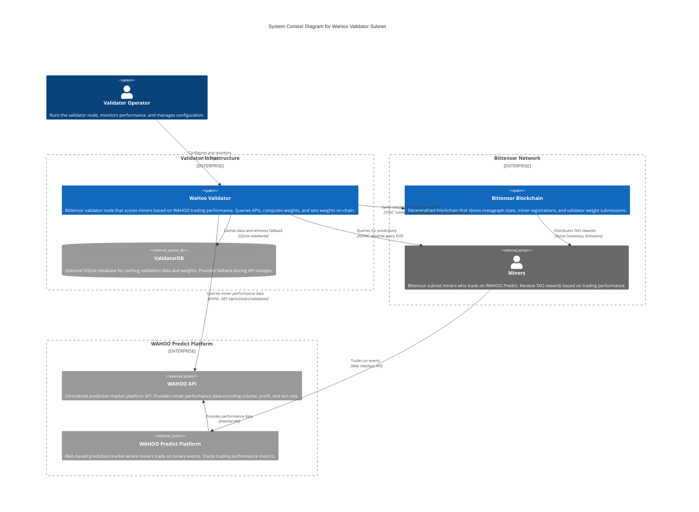
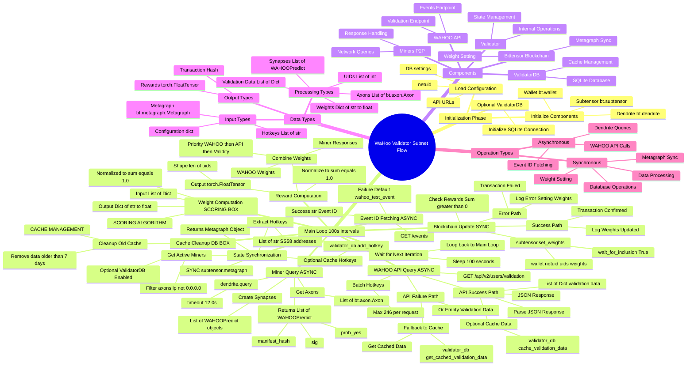
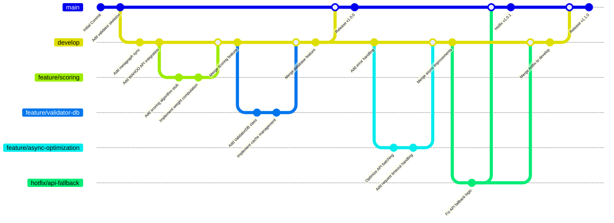

# WaHoo Subnet Flow Design - Mermaid Diagrams

## Option 1: C4 Context Diagram (System Architecture)

This C4 diagram shows the system context and relationships between components:

## Option 2: Mindmap (Hierarchical Overview)

This mindmap provides a hierarchical view of the validator subnet flow:

## Option 3: Sequence Diagram (Recommended for Clarity)

This sequence diagram shows the interactions between components over time, making async/sync operations clearer:

```mermaid
sequenceDiagram
    participant V as Validator
    participant B as Bittensor Blockchain
    participant W as WAHOO API
    participant D as ValidatorDB
    participant M as Miners (P2P)
    
    Note over V: Initialization Phase
    V->>V: Initialize Wallet, Subtensor, Dendrite
    V->>V: Load Configuration (netuid, API URLs)
    alt ValidatorDB Enabled
        V->>D: Initialize SQLite Connection
    end
    
    loop Main Loop (~100s intervals)
        Note over V: State Synchronization
        V->>B: SYNC: subtensor.metagraph(netuid)
        B-->>V: Metagraph Object (bt.metagraph.Metagraph)
        
        V->>V: Get Active Miners<br/>Filter: axons.ip != 0.0.0.0
        V->>V: Extract Hotkeys<br/>List[str] SS58 addresses
        
        alt ValidatorDB Enabled
            V->>D: Cache Hotkeys<br/>validator_db.add_hotkey()
        end
        
        Note over V: WAHOO API Query (ASYNC)
        V->>V: Batch Hotkeys (max 246 per request)
        V->>W: ASYNC: GET /api/v2/users/validation<br/>hotkeys, start_date, end_date
        
        alt API Success
            W-->>V: JSON Response<br/>List[Dict] validation data
            V->>V: Parse JSON Response
            alt ValidatorDB Enabled
                V->>D: Cache Validation Data<br/>validator_db.cache_validation_data()
            end
        else API Failure
            alt ValidatorDB Available
                V->>D: Get Cached Validation Data<br/>validator_db.get_cached_validation_data()
                D-->>V: Cached List[Dict]
            else No Cache
                V->>V: Empty Validation Data<br/>List[Dict]
            end
        end
        
        Note over V: Weight Computation (SCORING LOGIC BOX)
        V->>V: Compute Weights<br/>SCORING ALGORITHM<br/>Input: List[Dict]<br/>Output: Dict[str, float]
        Note right of V: Normalized to sum = 1.0
        
        Note over V: Event ID Fetching (ASYNC)
        V->>W: ASYNC: GET /events
        alt Event ID Retrieved
            W-->>V: str Event ID
        else API Failure
            V->>V: Default: "wahoo_test_event"
        end
        
        Note over V: Miner Query (ASYNC)
        V->>V: Create Synapses<br/>List[WAHOOPredict] objects
        V->>V: Get Axons<br/>List[bt.axon.Axon]
        V->>M: ASYNC: dendrite.query(axons, synapses)<br/>timeout=12.0s
        M-->>V: List[WAHOOPredict] responses<br/>prob_yes, manifest_hash, sig
        
        Note over V: Reward Computation
        V->>V: Compute Rewards<br/>Combine WAHOO Weights + Responses<br/>Priority: WAHOO > API > Validity
        V->>V: Normalize to sum = 1.0
        V->>V: torch.FloatTensor<br/>Shape: [len(uids)]
        
        alt Rewards Sum > 0
            Note over V: Blockchain Update (SYNC)
            V->>B: SYNC: subtensor.set_weights()<br/>wallet, netuid, uids, weights<br/>wait_for_inclusion=True
            alt Weights Set Successfully
                B-->>V: Transaction Confirmed
                V->>V: Log: Weights Updated
            else Error
                B-->>V: Transaction Failed
                V->>V: Log: Error Setting Weights
            end
        end
        
        alt ValidatorDB Enabled
            Note over V: Cache Cleanup (DATABASE OPERATIONS BOX)
            V->>D: Cleanup Old Cache<br/>Remove data > 7 days<br/>CACHE MANAGEMENT
        end
        
        Note over V: Wait for next iteration
        V->>V: Sleep 100 seconds
    end
```

## Option 4: Horizontal Flowchart (LR - Left to Right)

```mermaid
flowchart LR
    Start([Validator Startup]) --> Init[Initialize Components]
    
    Init --> InitWallet["Initialize Wallet<br/>bt.wallet"]
    Init --> InitSubtensor["Initialize Subtensor<br/>bt.subtensor"]
    Init --> InitDendrite["Initialize Dendrite<br/>bt.dendrite"]
    Init --> InitConfig["Load Configuration<br/>netuid, API URLs, DB settings"]
    
    InitWallet --> CheckDB{ValidatorDB<br/>Enabled?}
    InitSubtensor --> CheckDB
    InitDendrite --> CheckDB
    InitConfig --> CheckDB
    
    CheckDB -->|Yes| InitDB["Initialize ValidatorDB<br/>SQLite Connection"]
    CheckDB -->|No| MainLoop["Enter Main Loop"]
    InitDB --> MainLoop
    
    MainLoop["Main Validator Loop<br/>~100 second intervals"] --> SyncMetagraph["Sync Metagraph<br/>SYNC: subtensor.metagraph"]
    
    SyncMetagraph --> MetagraphData["Metagraph Object<br/>bt.metagraph.Metagraph"]
    
    MetagraphData --> GetActiveUids["Get Active Miners<br/>Filter: axons.ip != 0.0.0.0"]
    
    GetActiveUids --> ActiveUIDs["List[int]<br/>Active UIDs"]
    
    ActiveUIDs --> CheckMiners{Any Active<br/>Miners?}
    
    CheckMiners -->|No| Sleep1["Sleep 60s<br/>Wait for miners"]
    Sleep1 --> MainLoop
    
    CheckMiners -->|Yes| ExtractHotkeys["Extract Hotkeys<br/>metagraph.hotkeys"]
    
    ExtractHotkeys --> HotkeysList["List[str]<br/>SS58 Hotkey Addresses"]
    
    HotkeysList --> StoreHotkeys{ValidatorDB<br/>Enabled?}
    
    StoreHotkeys -->|Yes| CacheHotkeys["Cache Hotkeys<br/>validator_db.add_hotkey"]
    StoreHotkeys -->|No| QueryWAHOO
    CacheHotkeys --> QueryWAHOO
    
    QueryWAHOO["Query WAHOO API<br/>ASYNC: httpx.get<br/>GET /api/v2/users/validation"]
    
    QueryWAHOO --> BatchHotkeys["Batch Hotkeys<br/>Max 246 per request"]
    
    BatchHotkeys --> APIRequest["HTTP Request<br/>hotkeys, start_date, end_date"]
    
    APIRequest --> APIResponse{API<br/>Success?}
    
    APIResponse -->|Success| ParseResponse["Parse JSON Response<br/>Extract validation data"]
    APIResponse -->|Failure| CheckCache{ValidatorDB<br/>Available?}
    
    CheckCache -->|Yes| GetCachedData["Get Cached Validation Data<br/>validator_db.get_cached_validation_data"]
    CheckCache -->|No| EmptyValidation["Empty Validation Data<br/>List[Dict]"]
    GetCachedData --> ValidationData
    ParseResponse --> CacheValidation{ValidatorDB<br/>Enabled?}
    
    CacheValidation -->|Yes| StoreValidation["Cache Validation Data<br/>validator_db.cache_validation_data"]
    CacheValidation -->|No| ValidationData
    StoreValidation --> ValidationData
    
    ValidationData["List[Dict]<br/>Validation Data from WAHOO API<br/>hotkey, signature, message, performance"]
    
    ValidationData --> ComputeWeights["Compute Weights<br/>SCORING LOGIC<br/>Box: Scoring Algorithm"]
    
    ComputeWeights --> WeightsDict["Dict[str, float]<br/>Hotkey to Weight Mapping<br/>Normalized to sum = 1.0"]
    
    WeightsDict --> GetEventID["Get Active Event ID<br/>ASYNC: httpx.get<br/>GET /events"]
    
    GetEventID --> EventID{Event ID<br/>Retrieved?}
    
    EventID -->|Yes| EventIDStr["str<br/>Event ID"]
    EventID -->|No| DefaultEvent["str<br/>wahoo_test_event"]
    
    EventIDStr --> QueryMiners
    DefaultEvent --> QueryMiners
    
    QueryMiners["Query Miners<br/>ASYNC: dendrite.query<br/>P2P Network Requests"]
    
    QueryMiners --> CreateSynapses["Create Synapses<br/>WAHOOPredict objects<br/>event_id set"]
    
    CreateSynapses --> SynapsesList["List[WAHOOPredict]<br/>Synapse Objects"]
    
    SynapsesList --> GetAxons["Get Axons<br/>metagraph.axons"]
    
    GetAxons --> AxonsList["List[bt.axon.Axon]<br/>Network Endpoints"]
    
    AxonsList --> DendriteQuery["Dendrite Query<br/>timeout=12.0s<br/>deserialize=True"]
    
    DendriteQuery --> MinerResponses["List[WAHOOPredict]<br/>Miner Responses<br/>prob_yes, manifest_hash, sig"]
    
    MinerResponses --> ComputeRewards["Compute Rewards<br/>reward function"]
    
    ComputeRewards --> CombineWeights["Combine WAHOO Weights<br/>+ Miner Responses<br/>Priority: WAHOO > API > Validity"]
    
    CombineWeights --> RewardsTensor["torch.FloatTensor<br/>Shape: len(uids)<br/>Values sum to 1.0"]
    
    RewardsTensor --> CheckRewards{Rewards<br/>Sum > 0?}
    
    CheckRewards -->|No| CleanupCache
    CheckRewards -->|Yes| SetWeights["Set Weights On-Chain<br/>SYNC: subtensor.set_weights<br/>Blockchain Transaction"]
    
    SetWeights --> SetWeightsParams["Parameters:<br/>wallet, netuid, uids, weights<br/>wait_for_inclusion=True"]
    
    SetWeightsParams --> WeightSetResult{Weights<br/>Set Successfully?}
    
    WeightSetResult -->|Success| LogWeights["Log: Weights Updated<br/>len(uids) miners"]
    WeightSetResult -->|Error| LogError["Log: Error Setting Weights<br/>Exception details"]
    
    LogWeights --> CleanupCache
    LogError --> CleanupCache
    
    CleanupCache{ValidatorDB<br/>Enabled?}
    
    CleanupCache -->|Yes| CleanupOldCache["Cleanup Old Cache<br/>Remove data > 7 days<br/>DATABASE OPERATIONS<br/>Box: Cache Management"]
    CleanupCache -->|No| SleepLoop
    CleanupOldCache --> SleepLoop
    
    SleepLoop["Sleep 100 seconds<br/>Wait for next iteration"]
    
    SleepLoop --> MainLoop
    
    EmptyValidation --> ComputeWeights
    
    style ComputeWeights fill:#ffcccc,stroke:#ff0000,stroke-width:2px
    style CleanupOldCache fill:#ffcccc,stroke:#ff0000,stroke-width:2px
    style QueryWAHOO fill:#ccffcc,stroke:#00ff00,stroke-width:2px
    style DendriteQuery fill:#ccffcc,stroke:#00ff00,stroke-width:2px
    style SetWeights fill:#ffffcc,stroke:#ffaa00,stroke-width:2px
    style SyncMetagraph fill:#ffffcc,stroke:#ffaa00,stroke-width:2px
```

## Option 5: Simplified Horizontal Flow (Key Steps Only)

For a cleaner view focusing on main operations:

```mermaid
flowchart LR
    Start([Start]) --> Init[Initialize]
    Init --> Loop[Main Loop]
    
    Loop --> Sync["Sync Metagraph<br/>SYNC<br/>bt.metagraph.Metagraph"]
    Sync --> Filter["Get Active Miners<br/>List[int] UIDs"]
    Filter --> Hotkeys["Extract Hotkeys<br/>List[str]"]
    
    Hotkeys --> WAHOO["Query WAHOO API<br/>ASYNC<br/>List[Dict] validation data"]
    WAHOO --> Score["Compute Weights<br/>SCORING BOX<br/>Dict[str, float]"]
    
    Score --> Query["Query Miners<br/>ASYNC<br/>List[WAHOOPredict]"]
    Query --> Rewards["Compute Rewards<br/>torch.FloatTensor"]
    
    Rewards --> Set["Set Weights<br/>SYNC<br/>Blockchain"]
    Set --> Cleanup["Cleanup Cache<br/>DB BOX"]
    Cleanup --> Sleep["Sleep 100s"]
    Sleep --> Loop
    
    style Score fill:#ffcccc,stroke:#ff0000
    style Cleanup fill:#ffcccc,stroke:#ff0000
    style WAHOO fill:#ccffcc,stroke:#00ff00
    style Query fill:#ccffcc,stroke:#00ff00
    style Set fill:#ffffcc,stroke:#ffaa00
    style Sync fill:#ffffcc,stroke:#ffaa00
```

## Option 6: Validator-Only Sequence Diagram (Internal Operations)

This sequence diagram focuses solely on the validator's internal operations and function calls:

```mermaid
sequenceDiagram
    participant Main as main()
    participant Init as Initialization
    participant GetActive as get_active_uids()
    participant GetWAHOO as get_wahoo_validation_data()
    participant Batch as Batch Processing
    participant GetEvent as get_active_event_id()
    participant Compute as compute_final_weights()
    participant Reward as reward()
    participant SetW as set_weights()
    participant DB as ValidatorDB
    
    Note over Main: Validator Startup
    Main->>Init: Parse CLI arguments
    Main->>Init: Initialize Wallet
    Main->>Init: Initialize Subtensor
    Main->>Init: Initialize Dendrite
    Main->>Init: Load Configuration
    
    alt ValidatorDB Enabled
        Main->>DB: Initialize ValidatorDB
        DB-->>Main: SQLite Connection
    end
    
    loop Main Loop (~100s intervals)
        Note over Main: State Synchronization
        Main->>Main: subtensor.metagraph(netuid)
        Main-->>Main: Metagraph Object
        
        Main->>GetActive: get_active_uids(metagraph)
        GetActive->>GetActive: Filter: axons[uid].ip != "0.0.0.0"
        GetActive-->>Main: List[int] active_uids
        
        alt No Active Miners
            Main->>Main: Sleep 60s
            Main->>Main: Continue loop
        end
        
        Main->>Main: Extract Hotkeys<br/>metagraph.hotkeys[uid]
        Main-->>Main: List[str] hotkeys
        
        alt ValidatorDB Enabled
            Main->>DB: add_hotkey(hotkey)
        end
        
        Note over Main: WAHOO API Query
        Main->>GetWAHOO: get_wahoo_validation_data(hotkeys)
        GetWAHOO->>Batch: Batch Hotkeys (max 246)
        
        loop For each batch
            Batch->>Batch: Make HTTP Request
            alt API Success
                Batch-->>GetWAHOO: JSON Response
                GetWAHOO->>GetWAHOO: Parse JSON
                alt ValidatorDB Enabled
                    GetWAHOO->>DB: cache_validation_data()
                end
            else API Failure
                alt ValidatorDB Available
                    GetWAHOO->>DB: get_cached_validation_data()
                    DB-->>GetWAHOO: Cached Data
                else No Cache
                    GetWAHOO-->>GetWAHOO: Empty List
                end
            end
        end
        
        GetWAHOO-->>Main: List[Dict] validation_data
        
        Note over Main: Weight Computation
        Main->>Compute: compute_final_weights(validation_data)
        Compute->>Compute: Filter by min thresholds
        Compute->>Compute: Rank by spending
        Compute->>Compute: Rank by volume
        Compute->>Compute: Combine rankings
        Compute->>Compute: Normalize to sum = 1.0
        Compute-->>Main: Dict[str, float] wahoo_weights
        
        Note over Main: Event ID Fetching
        Main->>GetEvent: get_active_event_id(API_BASE_URL)
        GetEvent->>GetEvent: HTTP GET /events
        alt Event Retrieved
            GetEvent-->>Main: str event_id
        else API Failure
            GetEvent-->>Main: "wahoo_test_event"
        end
        
        Note over Main: Miner Query
        Main->>Main: Create Synapses<br/>List[WAHOOPredict]
        Main->>Main: Get Axons<br/>List[bt.axon.Axon]
        Main->>Main: dendrite.query(axons, synapses)
        Main-->>Main: List[WAHOOPredict] responses
        
        Note over Main: Reward Computation
        Main->>Reward: reward(responses, uids, metagraph, ...)
        Reward->>Reward: Check WAHOO weights (PRIMARY)
        alt WAHOO weights available
            Reward->>Reward: Use wahoo_weights[miner_id]
        else Check API weights
            Reward->>Reward: get_weights_from_api()
            alt API weights available
                Reward->>Reward: Use api_weights[miner_id]
            else Check response validity
                Reward->>Reward: Validate prob_yes in [0.0, 1.0]
                alt Valid response
                    Reward->>Reward: Assign weight 1.0
                else Invalid response
                    Reward->>Reward: Assign weight 0.0
                end
            end
        end
        Reward->>Reward: Normalize to sum = 1.0
        Reward-->>Main: torch.FloatTensor rewards
        
        alt Rewards Sum > 0
            Note over Main: Blockchain Update
            Main->>SetW: subtensor.set_weights(wallet, netuid, uids, weights)
            alt Weights Set Successfully
                SetW-->>Main: Transaction Confirmed
                Main->>Main: Log: Weights Updated
            else Error
                SetW-->>Main: Exception
                Main->>Main: Log: Error Setting Weights
            end
        end
        
        alt ValidatorDB Enabled
            Note over Main: Cache Cleanup
            Main->>DB: cleanup_old_cache(days=7)
        end
        
        Note over Main: Wait for next iteration
        Main->>Main: Sleep 100 seconds
    end
```

## Option 7: Validator Functions Decision Tree

This decision tree shows all validator functions and their decision logic:

```mermaid
flowchart TD
    Start([Validator Start]) --> Main[main Function]
    
    Main --> Init{Initialize Components}
    Init --> Wallet[Initialize Wallet]
    Init --> Subtensor[Initialize Subtensor]
    Init --> Dendrite[Initialize Dendrite]
    Init --> Config[Load Configuration]
    
    Wallet --> CheckDB{ValidatorDB<br/>Enabled?}
    Subtensor --> CheckDB
    Dendrite --> CheckDB
    Config --> CheckDB
    
    CheckDB -->|Yes| InitDB[Initialize ValidatorDB]
    CheckDB -->|No| Loop[Enter Main Loop]
    InitDB --> Loop
    
    Loop --> SyncMetagraph[Sync Metagraph<br/>subtensor.metagraph]
    SyncMetagraph --> GetActive[get_active_uids Function]
    
    GetActive --> FilterActive{"Filter Miners<br/>axons.ip not 0.0.0.0"}
    FilterActive -->|Active| ReturnUIDs["List of int active_uids"]
    FilterActive -->|Inactive| SkipUID["Skip miner"]
    
    ReturnUIDs --> CheckMiners{Any Active<br/>Miners?}
    CheckMiners -->|No| Sleep60[Sleep 60s<br/>Continue Loop]
    Sleep60 --> Loop
    
    CheckMiners -->|Yes| ExtractHotkeys[Extract Hotkeys<br/>metagraph.hotkeys]
    ExtractHotkeys --> StoreHotkeys{ValidatorDB<br/>Enabled?}
    
    StoreHotkeys -->|Yes| AddHotkey[DB.add_hotkey]
    StoreHotkeys -->|No| GetWAHOO
    AddHotkey --> GetWAHOO
    
    GetWAHOO[get_wahoo_validation_data Function] --> BatchHotkeys[Batch Hotkeys<br/>Max 246 per request]
    
    BatchHotkeys --> MakeRequest[Make HTTP Request<br/>GET /api/v2/users/validation]
    MakeRequest --> APIResult{API<br/>Response?}
    
    APIResult -->|Success| ParseJSON[Parse JSON Response]
    APIResult -->|Failure| CheckCache{ValidatorDB<br/>Available?}
    
    ParseJSON --> CacheData{ValidatorDB<br/>Enabled?}
    CacheData -->|Yes| StoreCache[DB.cache_validation_data]
    CacheData -->|No| ReturnData
    StoreCache --> ReturnData
    
    CheckCache -->|Yes| GetCache[DB.get_cached_validation_data]
    CheckCache -->|No| EmptyData[Return Empty List]
    GetCache --> ReturnData
    EmptyData --> ReturnData
    
    ReturnData["List of Dict validation_data"] --> ComputeWeights["compute_final_weights Function"]
    
    ComputeWeights --> FilterThresholds{Filter by<br/>Min Thresholds}
    FilterThresholds -->|Meets Threshold| RankSpending[Rank by Spending<br/>total_volume_usd]
    FilterThresholds -->|Below Threshold| ExcludeMiner[Exclude Miner]
    
    RankSpending --> RankVolume["Rank by Volume<br/>total_volume_usd"]
    RankVolume --> CombineRanks["Combine Rankings<br/>Weighted Average"]
    CombineRanks --> Normalize["Normalize to sum equals 1.0"]
    Normalize --> ReturnWeights["Dict of str to float weights"]
    
    ReturnWeights --> GetEvent[get_active_event_id Function]
    GetEvent --> EventRequest[HTTP GET /events]
    EventRequest --> EventResult{Event ID<br/>Retrieved?}
    
    EventResult -->|Yes| ReturnEventID["str event_id"]
    EventResult -->|No| DefaultEvent["wahoo_test_event"]
    
    ReturnEventID --> QueryMiners[Query Miners]
    DefaultEvent --> QueryMiners
    
    QueryMiners --> CreateSynapses["Create Synapses<br/>List of WAHOOPredict"]
    CreateSynapses --> GetAxons["Get Axons<br/>List of bt.axon.Axon"]
    GetAxons --> DendriteQuery["dendrite.query<br/>timeout 12.0s"]
    DendriteQuery --> MinerResponses["List of WAHOOPredict responses"]
    
    MinerResponses --> ComputeRewards[reward Function]
    
    ComputeRewards --> CheckWAHOO{"WAHOO Weights<br/>Available?"}
    CheckWAHOO -->|Yes| UseWAHOO["Use wahoo_weights for miner_id"]
    CheckWAHOO -->|No| CheckAPI{"API Weights<br/>Available?"}
    
    CheckAPI -->|Yes| GetAPIWeights["get_weights_from_api Function"]
    GetAPIWeights --> UseAPI["Use api_weights for miner_id"]
    CheckAPI -->|No| CheckResponse{Response<br/>Valid?}
    
    CheckResponse -->|Valid prob_yes| UseResponse["Assign weight 1.0"]
    CheckResponse -->|Invalid| UseZero["Assign weight 0.0"]
    
    UseWAHOO --> NormalizeRewards
    UseAPI --> NormalizeRewards
    UseResponse --> NormalizeRewards
    UseZero --> NormalizeRewards
    
    NormalizeRewards["Normalize to sum equals 1.0"] --> ReturnRewards["torch.FloatTensor rewards"]
    
    ReturnRewards --> CheckRewardsSum{"Rewards<br/>Sum greater than 0?"}
    CheckRewardsSum -->|No| Cleanup
    CheckRewardsSum -->|Yes| SetWeights["subtensor.set_weights Function"]
    
    SetWeights --> WaitInclusion["Wait for inclusion"]
    WaitInclusion --> WeightResult{"Weights<br/>Set Successfully?"}
    
    WeightResult -->|Success| LogSuccess["Log Weights Updated"]
    WeightResult -->|Error| LogError["Log Error Setting Weights"]
    
    LogSuccess --> Cleanup
    LogError --> Cleanup
    
    Cleanup{ValidatorDB<br/>Enabled?}
    Cleanup -->|Yes| CleanupCache["DB.cleanup_old_cache<br/>Remove data older than 7 days"]
    Cleanup -->|No| Sleep100
    CleanupCache --> Sleep100
    
    Sleep100["Sleep 100 seconds"] --> Loop
    
    style ComputeWeights fill:#ffcccc,stroke:#ff0000,stroke-width:2px
    style CleanupCache fill:#ffcccc,stroke:#ff0000,stroke-width:2px
    style GetWAHOO fill:#ccffcc,stroke:#00ff00,stroke-width:2px
    style DendriteQuery fill:#ccffcc,stroke:#00ff00,stroke-width:2px
    style SetWeights fill:#ffffcc,stroke:#ffaa00,stroke-width:2px
    style SyncMetagraph fill:#ffffcc,stroke:#ffaa00,stroke-width:2px
```

## Option 8: Git Graph (Development Workflow)

This Git graph shows the typical development workflow and branching strategy:

## Data Type Flow Summary

### Input Types
- **Configuration**: `dict` - Environment variables and CLI args
- **Metagraph**: `bt.metagraph.Metagraph` - Blockchain state snapshot
- **Hotkeys**: `List[str]` - SS58 addresses
- **API Response**: `Dict[str, Any]` - JSON from WAHOO API

### Processing Types
- **UIDs**: `List[int]` - Miner unique identifiers
- **Validation Data**: `List[Dict[str, Any]]` - Performance metrics
- **Weights**: `Dict[str, float]` - Hotkey → weight mapping
- **Synapses**: `List[WAHOOPredict]` - Protocol objects
- **Axons**: `List[bt.axon.Axon]` - Network endpoints
- **Responses**: `List[WAHOOPredict]` - Miner responses

### Output Types
- **Rewards**: `torch.FloatTensor` - Shape `[len(uids)]`, sums to 1.0
- **Blockchain**: Transaction hash (from `set_weights`)

## Sync/Async Operations

### Synchronous Operations
- **Metagraph Sync**: `subtensor.metagraph()` - Blockchain read
- **Weight Setting**: `subtensor.set_weights()` - Blockchain write
- **Database Operations**: SQLite read/write
- **Data Processing**: Scoring, normalization, filtering

### Asynchronous Operations
- **WAHOO API Calls**: `httpx.get()` - HTTP requests
- **Dendrite Queries**: `dendrite.query()` - P2P network requests
- **Event ID Fetching**: `httpx.get()` - HTTP request

## Key Decision Points

1. **ValidatorDB Enabled?** - Determines caching behavior
2. **Any Active Miners?** - Early exit if no miners
3. **API Success?** - Fallback to cached data
4. **Rewards Sum > 0?** - Only set weights if valid
5. **Weights Set Successfully?** - Error handling

## Work Units Breakdown

### Initialization Phase
- Wallet initialization
- Subtensor connection
- Dendrite setup
- Configuration loading
- Optional database setup

### Main Loop Phase (Repeats every ~100s)
1. **State Sync** - Metagraph synchronization
2. **Miner Discovery** - Active miner identification
3. **Data Fetching** - WAHOO API queries (async)
4. **Weight Computation** - Scoring algorithm (box)
5. **Miner Queries** - P2P network requests (async)
6. **Reward Calculation** - Combine weights + responses
7. **Blockchain Update** - Set weights on-chain (sync)
8. **Cache Management** - Database cleanup (box)
9. **Wait** - Sleep until next iteration

## Notes

- **Scoring Logic** (red box): Left as high-level box - implementation details TBD
- **Database Operations** (red box): Cache management details TBD
- **Async Operations** (green): Can run concurrently, handled by httpx/dendrite
- **Sync Operations** (yellow): Blocking operations, must complete before next step
- **Error Handling**: Graceful degradation at API failure points
- **Batching**: Hotkeys batched for API rate limits (max 246 per request)

