# 🚀 Wahooτ Roadmap: The Intelligence Layer for Prediction Markets

**Where Collective Intelligence Meets Decentralized Rewards**

*The first Bittensor subnet to monetize human predictive intelligence at scale*

---

## 🌐 Why This Matters: Prediction Markets + AI = The Future of Intelligence

**Prediction markets are exploding.** Polymarket hit $100M+ volume. Kalshi is mainstream. The world is waking up to the power of collective intelligence. But here's what everyone is missing: **prediction markets are the perfect training ground for AI, and AI is the perfect amplifier for prediction markets.**

### The Intelligence Flywheel

**The Connection**: Every trade is a labeled data point. Every market outcome is ground truth. Every prediction is a signal. Prediction markets generate **the highest-quality labeled datasets in existence**—real humans betting real money on real outcomes. This is the data that AI models dream of.

**Why Bittensor Needs This**: Bittensor is building the decentralized intelligence network. But intelligence isn't just compute—it's **forecasting ability**. Prediction markets are the purest form of intelligence validation: you're either right or wrong, and the market prices it instantly. By rewarding predictive intelligence on-chain, we're creating the **first subnet that directly measures and monetizes human forecasting ability**—the core skill that separates intelligence from computation.

**The Revolution**: We're not just rewarding traders. We're creating a **self-improving intelligence oracle** where:
- Human intuition provides the training data
- AI models learn from collective predictions
- The network becomes smarter with every trade
- **You earn TAO automatically** just by being good at predicting the future

**Auto Outside Income**: Trade on Wahooτ like you normally would. Our validators track your performance. You get paid in TAO. No code. No servers. No complexity. Just **passive income from your predictive intelligence**.

---

## 🚀 Launch: December 2025

### What We're Launching With

**The Foundation**: A fully operational Bittensor subnet that transforms prediction market trading into on-chain intelligence rewards.

#### Core Intelligence Infrastructure

**EMA-Based Scoring Engine**
- **Exponential Moving Average** with 12-hour half-life for temporal intelligence smoothing
- **Multi-dimensional evaluation**: Volume (USD), Realized Profit, Unrealized Profit, Win Rate
- **Volume exponent** (0.7 power law): Prevents whale dominance while rewarding consistent activity
- **Profit multiplier**: Dynamic PnL ratio that amplifies scores for profitable traders
- **Temporal intelligence**: Recent performance weighted more heavily—the network learns faster

**Validator Consensus Network**
- **Real-time API integration**: Direct connection to Wahooτ trading platform
- **Database persistence**: SQLite-based caching with EMA score history
- **Metagraph synchronization**: Automatic tempo-based loop intervals (network-aware)
- **Threshold validation**: Minimum volume and win rate gates to ensure quality
- **Distributed consensus**: Multiple validators independently verify trader performance

**Auto-Reward System**
- **Zero-configuration mining**: Link your hotkey, start trading, earn TAO
- **Real-time performance tracking**: Validators continuously monitor your trading activity
- **Automatic weight distribution**: Rewards calculated and distributed every epoch
- **Transparent scoring**: Public performance metrics—you know exactly why you're earning

```mermaid
graph TB
    A[Traders on Wahooτ] -->|Trade Activity| B[Wahooτ API]
    B -->|Performance Data| C[Validator Network]
    C -->|EMA Intelligence Scoring| D[Score Calculation]
    D -->|Weights| E[Bittensor Blockchain]
    E -->|TAO Rewards| A
    
    C -->|Cache| F[Validator DB]
    F -->|Historical Intelligence| D
    
    G[AI Models] -.->|Learn from| B
    G -.->|Enhanced Signals| D
    
    style A fill:#4A90E2
    style C fill:#50C878
    style E fill:#FF6B6B
    style D fill:#FFD93D
    style G fill:#9B59B6
```

#### Launch Metrics

- **Target**: 1,000+ registered miners within first month
- **Volume Threshold**: $10M+ monthly trading volume tracked
- **Validator Network**: 20+ active validators ensuring robust consensus
- **Reward Distribution**: Top 20% of traders receive 80% of TAO emissions (Pareto-optimal intelligence)

---

## 🧠 Q1 2026: Advanced Intelligence Scoring

### Multi-Dimensional Intelligence Operators

**The Evolution**: Move beyond single-metric scoring to a **modular intelligence pipeline** that captures the full spectrum of predictive ability.

#### Ensemble Scoring Architecture

**Sharpe Ratio Intelligence Scorer**
- **Risk-adjusted returns**: Reward traders who generate alpha per unit of risk
- **Rolling volatility windows**: Adaptive risk assessment based on market conditions
- **Maximum drawdown protection**: Penalize traders with excessive volatility
- **Why it matters**: Separates skilled traders from lucky gamblers

**Kelly Criterion Optimizer**
- **Optimal position sizing**: Reward traders who size positions based on edge and win rate
- **Capital efficiency**: Amplify scores for traders who maximize expected value
- **Bankroll management**: Identify traders with sustainable long-term strategies
- **Why it matters**: The difference between profitable traders and profitable *systems*

**Market Regime Detector**
- **Adaptive scoring**: Adjust reward weights based on market conditions (bull/bear/volatile)
- **Regime-specific performance**: Reward traders who excel in specific market environments
- **Temporal intelligence**: Recognize that different skills matter in different regimes
- **Why it matters**: Intelligence isn't static—it adapts to context

**Cross-Market Correlation Analyzer**
- **Diversification premium**: Reward traders who perform across multiple event categories
- **Category specialization**: Identify domain experts (politics, sports, crypto, etc.)
- **Portfolio intelligence**: Measure how well traders manage risk across markets
- **Why it matters**: True intelligence is generalizable, not narrow

### Machine Learning Intelligence Layer

**Adaptive Alpha Tuning**
- **Reinforcement learning**: Optimize EMA decay rates based on network performance
- **Self-improving parameters**: The scoring system gets smarter over time
- **A/B testing framework**: Continuously experiment with scoring configurations
- **Why it matters**: The network learns what makes a good trader

**Anomaly Detection & Manipulation Prevention**
- **Wash trading detection**: Identify and penalize artificial volume
- **Sybil resistance**: Detect coordinated manipulation attempts
- **Pattern recognition**: ML models identify suspicious trading behavior
- **Why it matters**: Protect the integrity of the intelligence network

**Predictive Performance Forecasting**
- **Future performance prediction**: Forecast trader success using historical patterns
- **Early talent identification**: Reward promising traders before they prove themselves
- **Risk assessment**: Predict which traders are likely to fail
- **Why it matters**: Anticipate intelligence, don't just measure it

**Latent Signal Extraction**
- **Feature engineering**: Extract hidden signals from trading behavior
  - **Timing intelligence**: When traders enter/exit positions
  - **Market selection**: Which markets traders choose to trade
  - **Position sizing patterns**: How traders manage capital
  - **Response to news**: How quickly traders react to information
- **Why it matters**: The best intelligence is invisible to the naked eye

### Validator Intelligence Consensus

**Weighted Validator Voting**
- **Reputation-based weights**: Validators with better historical accuracy get higher voting power
- **Consensus intelligence**: The network's assessment improves as validators improve
- **Anti-gaming**: Prevent validators from colluding or gaming the system
- **Why it matters**: Decentralized intelligence requires decentralized validation

**Cross-Validation Framework**
- **Validator-to-validator validation**: Validators validate each other's scoring methodologies
- **Methodology diversity**: Encourage different scoring approaches for robustness
- **Consensus building**: Validators converge on optimal scoring strategies
- **Why it matters**: Multiple perspectives create better intelligence

**Outlier Detection & Correction**
- **Statistical anomaly detection**: Flag validators with scoring distributions far from consensus
- **Automatic correction**: Adjust outlier validator weights to maintain network integrity
- **Transparency**: Public validator performance metrics
- **Why it matters**: Maintain quality as the network scales

**Dynamic Validator Rewards**
- **Performance-based compensation**: Validators earn more TAO for accurate miner assessment
- **Alignment incentives**: Reward validators who identify top traders early
- **Long-term thinking**: Penalize validators who optimize for short-term gains
- **Why it matters**: Align validator incentives with network intelligence goals

---

## 🎯 The Intelligence Revolution

**Why This Matters to Bittensor**: We're not just another subnet. We're proving that **human intelligence can be measured, validated, and rewarded on-chain**. Prediction markets are the perfect testbed because they provide instant, objective feedback: you're either right or wrong, and the market prices it immediately.

**Why Prediction Markets + AI**: 
- **Training data**: Every trade is a labeled example of human intelligence
- **Pattern recognition**: AI identifies signals humans miss
- **Collective intelligence**: The network becomes smarter than any individual
- **Continuous learning**: Every outcome improves the system

**Why Auto Outside Income Matters**: 
- **Democratization**: Anyone can earn, not just developers
- **Real skills**: Rewards actual predictive ability, not coding skills
- **Passive income**: Trade like normal, earn TAO automatically
- **Scalability**: The network grows as more traders join

**The Vision**: We're building the **decentralized oracle for human predictive intelligence**. Every trade, every prediction, every outcome makes the network smarter. And as the network gets smarter, it becomes more valuable. This is the flywheel that will make Wahooτ the most important intelligence subnet on Bittensor.

---

**The Future of Intelligence is Decentralized**

*Where every prediction matters, and every trader is rewarded for their intelligence.*

[Wahooτ Platform](https://wahoopredict.com) | [Bittensor Docs](https://docs.learnbittensor.org) | [Subnet 30](https://taostats.io/subnet/30)

**Launch: December 2025** | **Q1 2026: Advanced Intelligence Scoring**

